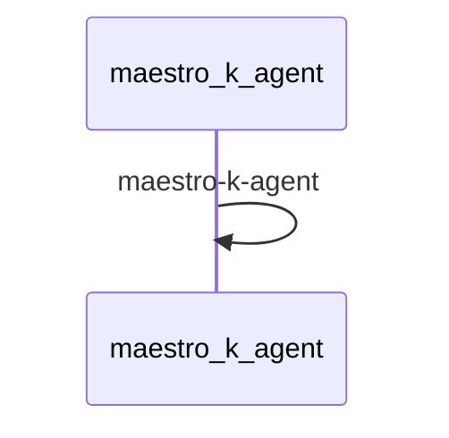

# Weather Checker Demo

This demo shows how to use Maestro to create a workflow that checks and reports weather conditions.

## Prerequisites

* Python 3.12 or higher
* [uv](https://github.com/astral-sh/uv) package manager
* [maestro](https://github.com/AI4quantum/maestro) installed
* A local instance of the LLM


## Setup

Install maestro:
```bash
pip install git+https://github.com/AI4quantum/maestro.git@v0.5.0
```

**Note**: This repository contains demos for Maestro. The main Maestro project can be found at [https://github.com/AI4quantum/maestro](https://github.com/AI4quantum/maestro).

## Mermaid Diagram

<!-- MERMAID_START -->

<!-- MERMAID_END -->


## Getting Started

* Verify a valid llm is available (default: "llama3.1:latest")

* Configure environmental variables: `cp demos/example.env .env`

* kubernetes cluster is available

* kubectl is installed

## Running workflow

Assuming you are in maestro-demo level:

To run the workflow:

```bash
./workflows/maestro-k/test.sh
```

By default, this demo uses a mock agent.  To run with real agent, commect out line 90-91 and enable line 94-95 in workflow/maestro-k/test.sh

## Clean up

To stop the mcp server

```bash
kubectl delete mcpserver maestro-k
```

To delete ToolHive operator
```bash
helm uninstall toolhive-operator -n toolhive-system
helm uninstall toolhive-operator-crds
```
