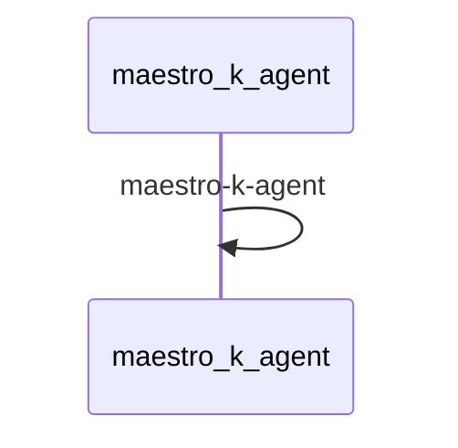

# Weather Checker Demo

This demo shows how to use Maestro to create a workflow that checks and reports weather conditions.

## Prerequisites

* Python 3.12 or higher
* [uv](https://github.com/astral-sh/uv) package manager
* [maestro](https://github.com/AI4quantum/maestro) installed
* A local instance of the LLM


## Setup

Install maestro:
```bash
pip install git+https://github.com/AI4quantum/maestro.git@v0.1.0
```

**Note**: This repository contains demos for Maestro. The main Maestro project can be found at [https://github.com/AI4quantum/maestro](https://github.com/AI4quantum/maestro).

## Mermaid Diagram

<!-- MERMAID_START -->

<!-- MERMAID_END -->


## Getting Started

* Run a local instance of the [bee-stack](https://github.com/AI4quantum/bee-stack/blob/main/README.md)

* Verify a valid llm is available

* Configure environmental variables: `cp demos/example.env .env`

## Running workflow

Assuming you are in maestro-demo level:

To run the workflow:

```bash
maestro run ./workflows/maestro-k/agents.yaml ./workflows/maestro-k/workflow.yaml
```

OR

Directly deploy the workflow via streamlit:
```bash
maestro deploy ./workflows/maestro-k/agents.yaml ./demos/workflows/maestro-k/workflow.yaml
```
