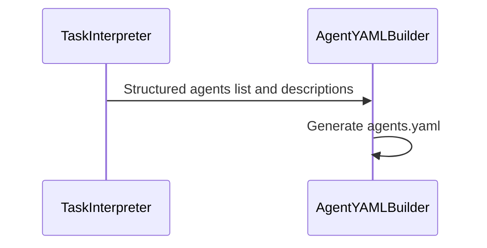
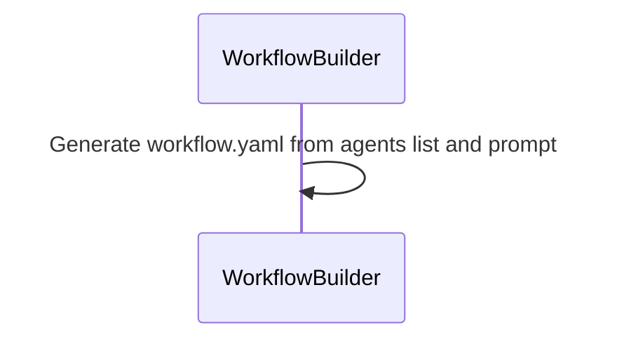

# Meta Agents v2

Two meta-generation demos that power automatic authoring of Maestro files:

- Agents file generation: builds `agents.yaml` from a natural-language goal
- Workflow file generation: builds `workflow.yaml` from an agents list

These flows serve as the backend reference for Maestro Builder, which uses similar agent chains to generate and iterate on agent and workflow definitions from plain English.

## Prerequisites

- Python 3.11 or higher
- uv (recommended) or pip
- Maestro installed

## Directory Layout

- `agents_file_generation/` – agents and workflow to generate an `agents.yaml`
- `workflow_file_generation/` – agents and workflow to generate a `workflow.yaml`

## Run: Agents File Generation

From the repository root:

1. Create the agents used by this flow

```bash
maestro create ./workflows/meta-agents-v2/agents_file_generation/agents.yaml
```

1. Run the workflow to produce an agents file

```bash
maestro run ./workflows/meta-agents-v2/agents_file_generation/workflow.yaml
```

- Edit the `prompt` in `workflow.yaml` to change what agents are generated.

## Run: Workflow File Generation

From the repository root:

1. Create the agent used by this flow

```bash
maestro create ./workflows/meta-agents-v2/workflow_file_generation/agents.yaml
```

1. Run the workflow to produce a workflow file

```bash
maestro run ./workflows/meta-agents-v2/workflow_file_generation/workflow.yaml
```

- Edit the `prompt` in `workflow.yaml` to change the target workflow contents.

## Mermaid Diagram: Agent Generation

<!-- MERMAID_START -->

<!-- MERMAID_END -->

## Mermaid Diagram: Workflow Generation

<!-- MERMAID_START -->

<!-- MERMAID_END -->

## Notes

- These demos mirror the generation capabilities that Maestro Builder exposes in the UI, acting as a simple backend reference implementation.
- If you prefer `uv`, you can also run: `uv run maestro create …` and `uv run maestro run …`.
