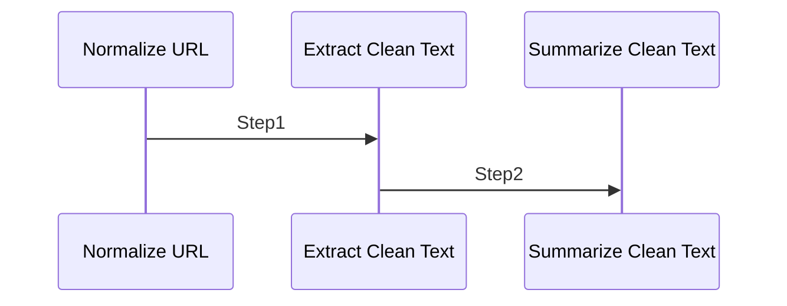

# Summary2 AI – arXiv URL → Clean Text → LLM Summary

## Mermaid Diagram

<!-- MERMAID_START -->

<!-- MERMAID_END -->

Pipeline stages:
- arxiv-normalize-url: Normalize a full arXiv URL or ID to a canonical ID.
- arxiv-extract-fulltext: Download PDF, extract with Docling, remove references/boilerplate.
- summarize-clean-text: Summarize the cleaned text with `gpt-oss:latest`.

## Prerequisites

- A virtual environment activated
- Maestro installed
- Docling installed (required for PDF extraction)
- An OpenAI-compatible endpoint configured for `gpt-oss:latest` (e.g., Ollama)

Note on lxml: Docling prefers `lxml<6`. If other tools require `lxml>=6`, pin versions accordingly or separate into different venvs.

## Run

Always pass both files (agents first):

```bash
source .venv/bin/activate
maestro run workflows/summary.ai/agents.yaml workflows/summary.ai/workflow.yaml
```

The default prompt is the Attention paper URL. Edit `workflow.yaml` to point to another arXiv URL/ID.